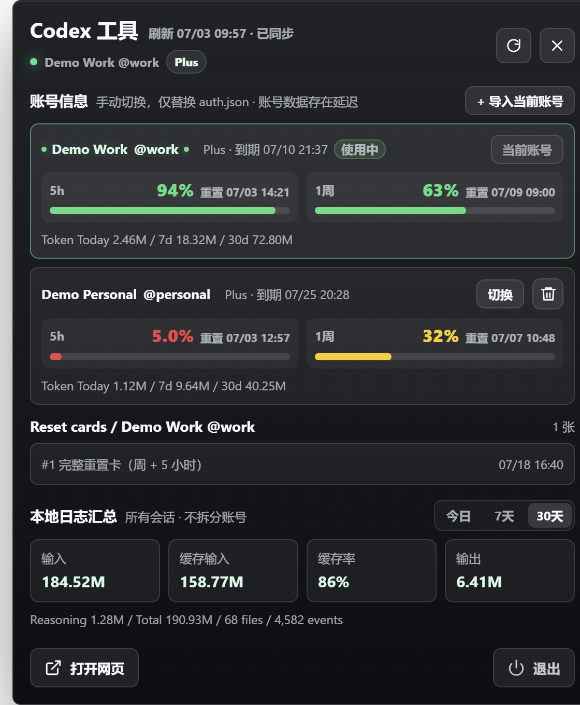

# Codex Usage Float

一个面向 Windows 桌面的 Codex 多账号用量悬浮工具。应用读取本机 Codex 登录状态，在轻量 Electron 浮窗中同时展示多个账号的 5 小时与 1 周额度、会员信息、重置卡、账号 Token 概览，以及所有本地会话的 Token 分类汇总。

> 这是非官方工具，不会绕过或修改 Codex / ChatGPT 的限制。界面中的用量、会员和重置卡信息取决于当前可访问的数据接口，本地日志统计则取决于 `~/.codex` 中保留的会话文件。

## 界面预览

<table>
  <tr>
    <td width="33%" align="center">
      <a href="docs/screenshots/multi-account-dashboard.png">
        
      </a>
      <br />
      <sub>多账号用量看板</sub>
    </td>
    <td width="33%" align="center">
      <a href="docs/screenshots/account-switch-confirm.png">
        
      </a>
      <br />
      <sub>账号切换确认</sub>
    </td>
    <td width="33%" align="center">
      <a href="docs/screenshots/local-token-summary.png">
        
      </a>
      <br />
      <sub>本地 Token 汇总</sub>
    </td>
  </tr>
</table>

截图使用示例账号名称，未包含真实登录凭据。

## 主要功能

- **桌面悬浮球**：常驻桌面，显示当前账号会员等级和 5 小时窗口剩余百分比。
- **多账号看板**：同时查看已导入账号的显示昵称、用户名、会员等级、会员到期时间、5 小时额度和 1 周额度。
- **手动账号切换**：经过确认后，用目标账号快照原子替换 `~/.codex/auth.json`；不修改 `CODEX_HOME` 和 `config.toml`，也不会自动轮换账号。
- **账号 Token 概览**：每个账号展示今日、7 天和 30 天总 Token。该数据来自账号接口，可能存在同步延迟。
- **本地日志汇总**：按今日、7 天和 30 天切换查看输入、缓存输入、缓存率、输出、推理输出、总计、文件数和 `token_count` 事件数。
- **重置卡列表**：显示当前账号的可用完整重置卡、适用窗口和预计有效期；超过 2 张时列表内部滚动。
- **自适应面板**：面板高度随内容变化，底部操作区保持独立，不与日志信息重叠。
- **便携打包**：使用 `electron-builder` 生成 Windows portable EXE，无需安装程序。

## 快速开始

### 环境要求

- Windows 10 或 Windows 11
- Node.js 20 或更高版本
- npm
- 已通过 Codex 登录，且存在 `~/.codex/auth.json`

### 安装与运行

```powershell
git clone https://github.com/dxawdc/codex-usage-float.git
cd codex-usage-float
npm install
npm start
```

开发模式与普通启动使用相同入口：

```powershell
npm run dev
```

## 多账号使用

1. 使用 Codex 官方登录流程登录第一个账号。
2. 打开本工具，点击“导入当前账号”。
3. 在 Codex 中退出并登录另一个账号。
4. 回到本工具，再次点击“导入当前账号”。
5. 后续可在账号卡片中点击“切换”，确认后替换当前 `auth.json`。

账号以登录令牌中的稳定用户或账号标识去重。重复导入同一账号时会更新已有快照、个人资料和用量，不会新增重复条目。

切换完成后，已经运行的 Codex 进程可能仍缓存旧认证状态。建议完全关闭并重新启动 Codex；如果仍无法使用，需要通过官方界面重新登录。此工具不模拟官方登录流程，只负责切换本机已有的认证快照。

## 数据来源与口径

### 账号、会员与额度

应用读取 `~/.codex/auth.json` 获取当前认证上下文，并请求当前账号可访问的 Codex / ChatGPT 数据接口：

- 个人资料：显示昵称和用户名。
- 会员信息：计划等级和会员到期时间。
- 额度窗口：5 小时、1 周的剩余百分比和重置时间。
- 重置卡：可用数量、适用窗口和有效期信息。

接口字段可能变化或暂时不可访问。刷新失败时，应用优先保留最近一次成功快照，避免用空响应覆盖有效数据。

### 账号 Token 概览

账号卡片中的今日、7 天和 30 天 Token 来自账号级统计接口。此口径适合比较不同账号的大致用量，但可能有延迟，也不一定提供输入、输出和缓存输入拆分。

### 本地日志汇总

底部“本地日志汇总”扫描以下目录中的 JSONL 会话文件：

```text
~/.codex/sessions
~/.codex/archived_sessions
```

应用读取 `token_count` 事件，并按累计值差分统计：

| 指标 | 含义 |
| --- | --- |
| 输入 | `input_tokens` |
| 缓存输入 | `cached_input_tokens` |
| 缓存率 | 缓存输入 / 输入；输入为 0 时显示 `--` |
| 输出 | `output_tokens` |
| 推理输出 | `reasoning_output_tokens` |
| 总计 | `total_tokens` |

本地日志汇总固定统计所有会话，不拆分账号。多个账号共用同一个 `~/.codex` 时，本地历史文件通常缺少可靠账号标识，因此不应将这部分数据解释为某个账号的精确账单。

## 颜色规则

额度颜色按照“剩余百分比”计算，5 小时与 1 周窗口分别着色：

| 剩余量 | 颜色 |
| --- | --- |
| `0% - 10%` | 红色 |
| `11% - 25%` | 橙色 |
| `26% - 50%` | 黄色 |
| `51% - 100%` | 绿色 |

悬浮球优先跟随当前账号 5 小时窗口的剩余量。

## 本地文件与安全

应用只在当前 Windows 用户目录中读写数据：

```text
~/.codex/auth.json
%APPDATA%/codex-usage-float/accounts.json
%APPDATA%/codex-usage-float/usage-state.json
```

- `accounts.json` 保存已导入账号的认证快照，以便后续切换；该文件包含敏感登录信息，请勿上传、分享或纳入备份公开范围。
- 当前版本未对账号快照额外加密，安全边界依赖 Windows 用户目录权限。请只在可信个人设备上使用。
- 应用不会把令牌写入调试日志、README、截图或 Git 仓库。
- 切换账号时先写入临时文件，再替换 `auth.json`，降低写入中断导致文件损坏的风险。

## 操作方式

- 单击或右键悬浮球：展开或收起详情面板。
- 双击悬浮球：立即刷新用量。
- 鼠标滚轮：调整悬浮球大小。
- 刷新按钮：刷新已保存账号、当前账号重置卡和本地日志汇总。
- 导入当前账号：读取当前 `auth.json` 并保存或更新账号快照。
- 切换：确认后替换当前 `auth.json`。
- 删除：从工具账号库中移除非当前账号，不会删除 Codex 会话文件。
- 打开网页：打开 ChatGPT / Codex 页面。
- 退出：关闭应用。

## 打包 Windows EXE

默认生成 Windows portable EXE：

```powershell
npm run build
```

产物输出到 `dist/`，文件名默认为：

```text
CodexUsageFloat-1.0.0.exe
```

如果 Electron 或 electron-builder 二进制下载较慢，可只为当前 PowerShell 会话设置镜像：

```powershell
$env:ELECTRON_MIRROR = "https://npmmirror.com/mirrors/electron/"
$env:ELECTRON_BUILDER_BINARIES_MIRROR = "https://npmmirror.com/mirrors/electron-builder-binaries/"
npm run build
```

`dist/` 已加入 `.gitignore`，EXE 不会自动提交到 GitHub。

## 项目结构

```text
src/main.js              Electron 主进程、数据同步、账号库和窗口管理
src/preload.js           安全 IPC 桥接
src/renderer/index.html  悬浮球、详情面板和确认弹窗结构
src/renderer/app.js      前端渲染与交互逻辑
src/renderer/styles.css  UI 样式和自适应布局
build/                   应用图标
docs/screenshots/        README 示例截图
```

## 已知限制

- Codex / ChatGPT 内部接口并非稳定公开契约，字段或访问规则变化可能导致部分信息暂时不可用。
- 账号 Token 接口可能延迟，且通常只有总量；输入、输出、缓存输入拆分主要来自本地日志。
- 本地日志无法可靠拆分共享 `~/.codex` 的多个账号。
- 替换 `auth.json` 不会刷新已运行进程的内存认证状态，账号切换后通常需要重启 Codex。
- EXE 默认未进行代码签名，Windows SmartScreen 可能显示未知发布者提示。

## License

MIT
