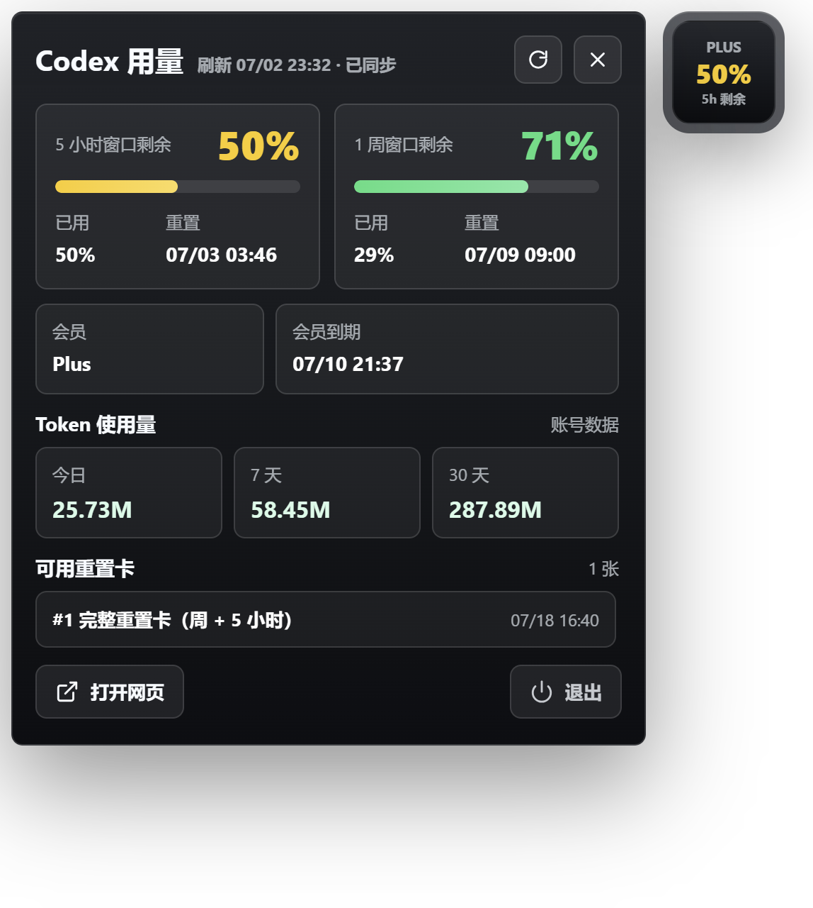
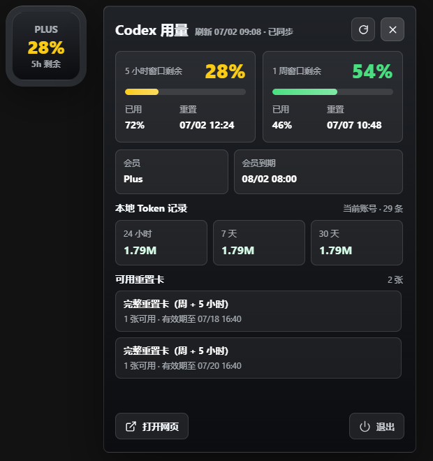
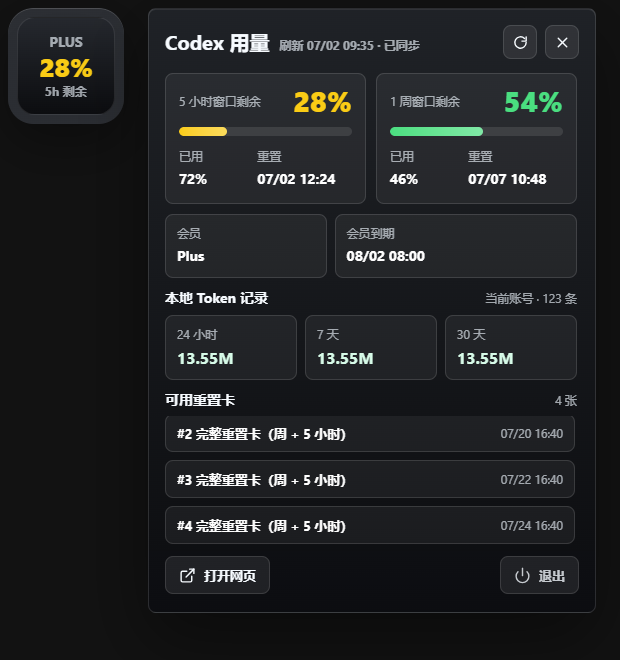

# Codex Usage Float

一个面向 Windows 桌面的 Codex 用量悬浮窗。它会读取本机 Codex 登录状态，并在一个轻量的 Electron 浮窗里展示 5 小时窗口、1 周窗口、重置卡、会员状态和 Token 使用量。

> 这是非官方工具。项目不会绕过或修改 Codex / ChatGPT 的限制，只是把本机可读取到的用量信息整理成更容易看的桌面面板。

## 截图

<table>
  <tr>
    <td width="33%" align="center">
      
      <br />
      <sub>完整用量面板</sub>
    </td>
    <td width="33%" align="center">
      
      <br />
      <sub>紧凑悬浮窗</sub>
    </td>
    <td width="33%" align="center">
      
      <br />
      <sub>重置卡列表</sub>
    </td>
  </tr>
</table>

## 主要功能

- **悬浮球**：常驻桌面，显示当前计划和 5 小时窗口剩余百分比。
- **5 小时窗口**：展示剩余百分比、已用百分比、下一次重置时间。
- **1 周窗口**：展示剩余百分比、已用百分比、下一次重置时间。
- **颜色提示**：按剩余额度显示红、橙、黄、绿，低剩余额度更醒目。
- **重置卡**：展示当前可用重置卡，包含完整重置卡编号、适用窗口和有效期。
- **Token 使用量**：展示今日、7 天、30 天 Token 统计。
- **一键刷新**：手动同步 Codex 用量数据。
- **打开网页**：直接打开 ChatGPT / Codex 页面，方便补充登录或查看官方页面。
- **便携打包**：支持通过 `electron-builder` 打包为 Windows portable EXE。

## 颜色规则

当前 UI 的主色按“剩余量百分比”判断：

| 剩余量 | 颜色 |
| --- | --- |
| `0% - 10%` | 红色 |
| `11% - 25%` | 橙色 |
| `26% - 50%` | 黄色 |
| `51% - 100%` | 绿色 |

悬浮球优先跟随 5 小时窗口的剩余量。详情面板中 5 小时和 1 周窗口分别按自己的剩余量上色。

## 数据来源与口径

应用会按优先级组合多种来源：

1. **本机 Codex 登录信息**
   - 读取 `~/.codex/auth.json`。
   - 用于识别当前计划、账号上下文，并请求可访问的 Codex 用量接口。
   - 不会把 access token 写入日志或应用状态文件。

2. **Codex 用量接口**
   - 用于获取 5 小时窗口、1 周窗口、重置时间、重置卡等信息。
   - 接口字段可能随官方调整而变化，所以应用会尽量做兼容解析，并保留最近一次成功快照。

3. **账号级 Token 统计**
   - 优先使用账号接口中的日/周/月统计桶。
   - 这类接口通常返回总 Token 数，不一定包含输入、输出、缓存输入等明细。

4. **本地 session 回退**
   - 当账号接口不可用时，会扫描 `~/.codex/sessions` 和 `~/.codex/archived_sessions`。
   - 本地 `token_count` 事件通常包含 `input_tokens`、`cached_input_tokens`、`output_tokens`、`reasoning_output_tokens`、`total_tokens`。
   - 如果同一个 `~/.codex` 下频繁切换账号，历史本地 Token 归属可能存在误差。

## 隐私与安全

- 不打印、不持久化 access token。
- 应用状态文件位于 `%APPDATA%/codex-usage-float/usage-state.json`。
- 构建产物、依赖目录、临时文件不会提交到 Git。
- README 截图只应使用不包含私人对话、账号详情、密钥或敏感项目内容的画面。

## 安装与运行

需要 Node.js 和 npm。

```powershell
npm install
npm start
```

开发时也可以使用：

```powershell
npm run dev
```

## 操作方式

- 单击或右键悬浮球：展开/收起详情面板。
- 双击悬浮球：立即刷新用量数据。
- 鼠标滚轮：调整悬浮球大小。
- 详情面板刷新按钮：手动同步最新数据。
- 打开网页：打开 ChatGPT / Codex 页面。
- 退出：关闭应用。

## 打包 EXE

默认打包为 Windows portable EXE：

```powershell
npm run build
```

构建产物输出到 `dist/`。该目录已加入 `.gitignore`，不会提交到仓库。

如果 Electron 下载较慢，可以设置镜像后再打包：

```powershell
$env:ELECTRON_MIRROR = "https://npmmirror.com/mirrors/electron/"
$env:ELECTRON_BUILDER_BINARIES_MIRROR = "https://npmmirror.com/mirrors/electron-builder-binaries/"
npm run build
```

如果普通打包卡在 `packaging` 阶段，可以先运行目录构建，再用 prepackaged 流程重新封装。项目里没有固定写死这个流程，避免把本机路径带进仓库。

## 项目结构

```text
src/main.js              Electron 主进程、数据同步、窗口管理
src/preload.js           安全 IPC 桥接
src/renderer/index.html  悬浮窗和详情面板结构
src/renderer/app.js      前端渲染与交互逻辑
src/renderer/styles.css  UI 样式
build/                   应用图标
docs/screenshots/        README 示例截图
```

## 已知限制

- 这是个人桌面辅助工具，不是官方账单或审计系统。
- Codex / ChatGPT 接口字段可能调整，导致部分字段暂时不可用。
- 账号级 Token 接口通常只有总量；输入、输出、缓存输入拆分主要来自本地 session 日志。
- 如果多个账号共用同一个 `~/.codex`，历史本地 Token 明细无法保证完全按账号精确拆分。
- 重置卡和用量窗口以当前接口返回为准；当接口不可访问时会显示最近一次成功同步的数据。

## License

MIT
