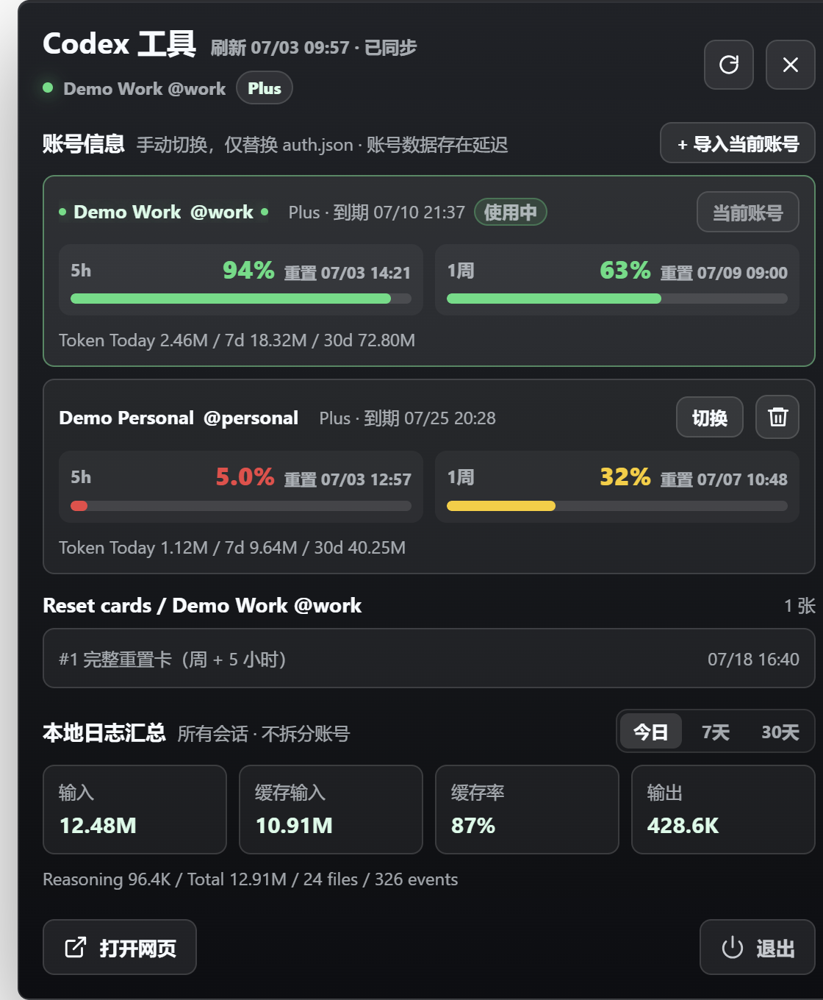
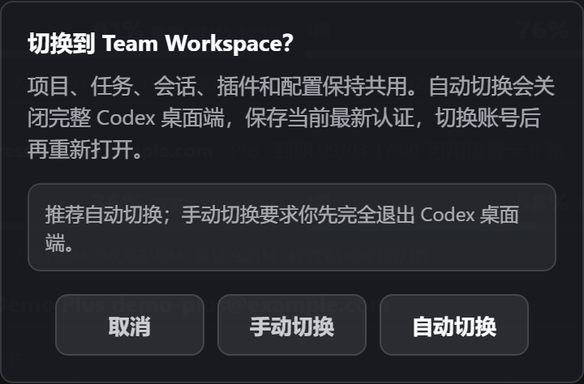
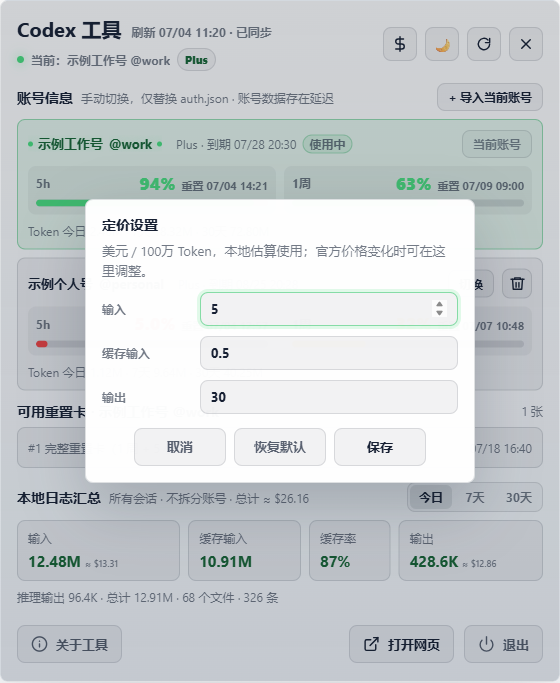

<div align="center">
  <h1>Codex Usage Float</h1>
  <p><strong>Codex 多账号用量、会员信息、重置卡与本地 Token 日志汇总工具</strong></p>
  <p><sub>作者 @可以叫我才哥</sub></p>
  <p>
    <a href="https://github.com/dxawdc/codex-usage-float/releases/latest"></a>
    <a href="LICENSE"></a>
    
    
  </p>
</div>

一个面向 Windows 桌面的轻量 Codex 多账号用量悬浮工具。应用读取本机 Codex 登录状态，同时展示多个账号的 5 小时与 1 周额度、会员信息、重置卡、账号 Token 概览，以及所有本地会话的 Token 分类汇总与费用估算；支持深色/浅色主题和自定义 Token 定价。

## 下载安装

无需配置 Node.js，直接下载 Windows 便携版 EXE 即可运行：

- **推荐下载**：[CodexUsageFloat v1.0.2](https://github.com/dxawdc/codex-usage-float/releases/latest/download/CodexUsageFloat-1.0.2.exe)
- **全部版本**：[GitHub Releases](https://github.com/dxawdc/codex-usage-float/releases)

下载后双击 EXE 即可启动，无需安装。应用目前没有商业代码签名，Windows SmartScreen 可能显示“未知发布者”；请确认下载地址来自本仓库，并按需核对 SHA-256：

| 版本 | 文件 | SHA-256 |
| --- | --- | --- |
| `v1.0.2` | `CodexUsageFloat-1.0.2.exe` | `E56DB820BF47D505F43A9C54084F130D405A6E06F3693C86F5EEBA83530A4224` |
| `v1.0.1` | `CodexUsageFloat-1.0.1.exe` | `30FD07B2F65A29E903164B7DB7CE71498EBA2E84D78C0ABF9CE8AB9A22DF665A` |

PowerShell 校验示例：

```powershell
Get-FileHash .\CodexUsageFloat-1.0.2.exe -Algorithm SHA256
```

## 版本更新记录

### 未发布

- 本地 JSONL 日志按会话模型拆分 Token 用量与费用估算，定价设置支持分别调整各模型的输入、缓存输入和输出价格。
- 优化详情面板的紧凑布局；账号超过 3 个时账号列表在面板内纵向滚动。
- 本地日志的模型用量改为双列展示，减少面板纵向占用。

### v1.0.2 - 2026-07-04

- 新增深色/浅色主题切换，并完整适配主面板、弹窗、悬浮球和底部操作区。
- 新增 Token 定价设置，可自定义输入、缓存输入和输出单价，本地保存后实时重算费用估值。
- 优化账号切换流程，提供取消、手动切换和自动切换三种操作；增加切换中、成功和失败反馈。
- 自动切换可在替换 `auth.json` 后检测并尝试重启正在运行的 Codex；手动切换会给出明确重启提示。
- 优化重复导入反馈和账号库刷新逻辑，降低切换后只显示当前账号的概率。
- 新增“关于工具”入口，调整底部操作布局，并清理未使用的旧代码。

### v1.0.1 - 2026-07-03

- 首个公开发布版本。
- 支持多账号导入、用量看板、5 小时和 1 周剩余额度、会员及重置卡信息。
- 支持本地会话 Token 的今日、7 天和 30 天分类汇总，以及 GPT-5.5 标准 API 费用估算。
- 支持通过替换 `~/.codex/auth.json` 手动切换已导入账号。

## 界面预览

<table>
  <tr>
    <td width="33%" align="center">
      <a href="docs/screenshots/multi-account-dashboard.png">
        
      </a>
      <br />
      <sub>多账号用量看板</sub>
    </td>
    <td width="33%" align="center">
      <a href="docs/screenshots/account-switch-confirm.png">
        
      </a>
      <br />
      <sub>账号切换确认</sub>
    </td>
    <td width="33%" align="center">
      <a href="docs/screenshots/pricing-settings-light.png">
        
      </a>
      <br />
      <sub>浅色主题与定价设置</sub>
    </td>
  </tr>
</table>

截图使用示例账号名称，未包含真实登录凭据。

## 主要功能

- **桌面悬浮球**：常驻桌面，显示当前账号会员等级和 5 小时窗口剩余百分比。
- **多账号看板**：同时查看已导入账号的显示昵称、用户名、会员等级、会员到期时间、5 小时额度和 1 周额度；账号超过 3 个时在列表内滚动。
- **可控账号切换**：提供手动切换与自动切换；均会原子替换 `~/.codex/auth.json`，自动切换还会尝试重启已运行的 Codex。工具不修改 `CODEX_HOME` 和 `config.toml`，也不会自动轮换账号。
- **账号 Token 概览**：每个账号展示今日、7 天和 30 天总 Token。该数据来自账号接口，可能存在同步延迟。
- **本地日志汇总**：按今日、7 天和 30 天切换查看输入、缓存输入、缓存率、输出、推理输出、总计、文件数和 `token_count` 事件数；按模型双列展示用量与费用，并使用独立模型费率估算总费用。
- **重置卡列表**：显示当前账号的可用完整重置卡、适用窗口和预计有效期；超过 2 张时列表内部滚动。
- **自适应面板**：面板高度随内容变化，底部操作区保持独立，不与日志信息重叠。
- **主题与定价设置**：支持深色/浅色主题；可在设置中维护输入、缓存输入和输出单价，适应后续价格调整。
- **过程反馈**：导入已有账号时明确提示已更新；账号切换展示进行中、成功或失败状态。
- **便携打包**：使用 `electron-builder` 生成 Windows portable EXE，无需安装程序。

## 快速开始

### 环境要求

- Windows 10 或 Windows 11
- Node.js 20 或更高版本
- npm
- 已通过 Codex 登录，且存在 `~/.codex/auth.json`

### 安装与运行

```powershell
git clone https://github.com/dxawdc/codex-usage-float.git
cd codex-usage-float
npm install
npm start
```

开发模式与普通启动使用相同入口：

```powershell
npm run dev
```

## 多账号使用

1. 使用 Codex 官方登录流程登录第一个账号。
2. 打开本工具，点击“导入当前账号”。
3. 在 Codex 中退出并登录另一个账号。
4. 回到本工具，再次点击“导入当前账号”。
5. 后续可在账号卡片中点击“切换”，选择“手动切换”或“自动切换”。

账号以登录令牌中的稳定用户或账号标识去重。重复导入同一账号时会更新已有快照、个人资料和用量，不会新增重复条目。

手动切换完成后，需要自行完全关闭并重新启动 Codex。自动切换会在替换认证快照后检测并尝试重启 Codex，但受安装方式、进程权限和程序路径影响，无法保证在所有环境都成功；失败时请手动重启。如果仍无法使用，需要通过官方界面重新登录。此工具不模拟官方登录流程，只负责切换本机已有的认证快照。

## 数据来源与口径

### 账号、会员与额度

应用读取 `~/.codex/auth.json` 获取当前认证上下文，并请求当前账号可访问的 Codex / ChatGPT 数据接口：

- 个人资料：显示昵称和用户名。
- 会员信息：计划等级和会员到期时间。
- 额度窗口：5 小时、1 周的剩余百分比和重置时间。
- 重置卡：可用数量、适用窗口和有效期信息。

接口字段可能变化或暂时不可访问。刷新失败时，应用优先保留最近一次成功快照，避免用空响应覆盖有效数据。

### 账号 Token 概览

账号卡片中的今日、7 天和 30 天 Token 来自账号级统计接口。此口径适合比较不同账号的大致用量，但可能有延迟，也不一定提供输入、输出和缓存输入拆分。

### 本地日志汇总

底部“本地日志汇总”扫描以下目录中的 JSONL 会话文件：

```text
~/.codex/sessions
~/.codex/archived_sessions
```

应用读取 `token_count` 事件，并按累计值差分统计：

| 指标 | 含义 |
| --- | --- |
| 输入 | `input_tokens` |
| 缓存输入 | `cached_input_tokens` |
| 缓存率 | 缓存输入 / 输入；输入为 0 时显示 `--` |
| 输出 | `output_tokens` |
| 推理输出 | `reasoning_output_tokens` |
| 总计 | `total_tokens` |

本地日志汇总固定统计所有会话，不拆分账号。多个账号共用同一个 `~/.codex` 时，本地历史文件通常缺少可靠账号标识，因此不应将这部分数据解释为某个账号的精确账单。

### 按模型费用估算与自定义定价

本地会话日志会读取同一会话中的 `turn_context.payload.model`，并将后续 `token_count` 增量按模型拆分。日志未提供模型上下文的历史用量会显示为“未识别模型”，可单独配置其兜底单价。

内置预设覆盖 GPT-5.6 Sol、GPT-5.6 Terra、GPT-5.6 Luna、GPT-5.5、GPT-5.4、GPT-5.4 Mini、GPT-5.3 Codex 和 GPT-5.2；可在定价设置中逐个模型修改输入、缓存输入和输出单价。新模型会随本地日志自动出现在设置中。

费用估算按模型采用内置的官方标准费率预设；可通过面板顶部的“定价设置”选择模型并修改输入、缓存输入和输出三项单价，保存后会立即重新计算本地汇总中的估算金额。各模型的官方费率可能变动，请以 OpenAI 的 [Codex rate card](https://help.openai.com/en/articles/20001106-codex-rate-card-2) 与 [模型价格页](https://developers.openai.com/api/docs/models) 为准：

```text
输入费用 = (输入 - 缓存输入) / 1,000,000 × 当前模型输入单价
         + 缓存输入 / 1,000,000 × 当前模型缓存输入单价
输出费用 = 输出 / 1,000,000 × 当前模型输出单价
总计费用 = 输入费用 + 输出费用
```

推理输出属于输出统计的一部分，不重复计费。该金额仅用于把本地 Token 用量换算成标准 API 价格的近似参考，并非 ChatGPT / Codex 订阅账单。本地汇总缺少可靠的逐请求计费模式和上下文长度，因此不计算长上下文、Fast、Priority、Batch、Flex 或数据区域费率差异。

## 颜色规则

额度颜色按照“剩余百分比”计算，5 小时与 1 周窗口分别着色：

| 剩余量 | 颜色 |
| --- | --- |
| `0% - 10%` | 红色 |
| `11% - 25%` | 橙色 |
| `26% - 50%` | 黄色 |
| `51% - 100%` | 绿色 |

悬浮球优先跟随当前账号 5 小时窗口的剩余量。

## 本地文件与安全

应用只在当前 Windows 用户目录中读写数据：

```text
~/.codex/auth.json
%APPDATA%/codex-usage-float/accounts.json
%APPDATA%/codex-usage-float/usage-state.json
%APPDATA%/codex-usage-float/Local Storage/
```

- `accounts.json` 保存已导入账号的认证快照，以便后续切换；该文件包含敏感登录信息，请勿上传、分享或纳入备份公开范围。
- 主题与自定义 Token 单价保存在 Electron 的本地存储目录中，只在当前 Windows 用户下生效，不会上传到远端。
- 当前版本未对账号快照额外加密，安全边界依赖 Windows 用户目录权限。请只在可信个人设备上使用。
- 应用不会把令牌写入调试日志、README、截图或 Git 仓库。
- 切换账号时先写入临时文件，再替换 `auth.json`，降低写入中断导致文件损坏的风险。

## 操作方式

- 单击或右键悬浮球：展开或收起详情面板。
- 双击悬浮球：立即刷新用量。
- 鼠标滚轮：调整悬浮球大小。
- 刷新按钮：刷新已保存账号、当前账号重置卡和本地日志汇总。
- 导入当前账号：读取当前 `auth.json` 并保存或更新账号快照。
- 手动切换：替换当前 `auth.json`，完成后由用户重启 Codex。
- 自动切换：替换当前 `auth.json`，并尝试检测、关闭和重新启动 Codex。
- 定价设置：调整本地 Token 费用估算使用的输入、缓存输入和输出单价。
- 主题切换：在深色与浅色界面之间切换，设置保存在本机。
- 删除：从工具账号库中移除非当前账号，不会删除 Codex 会话文件。
- 关于工具：打开本项目 GitHub 仓库。
- 打开网页：打开 ChatGPT / Codex 页面。
- 退出：关闭应用。

## 打包 Windows EXE

默认生成 Windows portable EXE：

```powershell
npm run build
```

产物输出到 `dist/`，文件名默认为：

```text
CodexUsageFloat-1.0.2.exe
```

如果 Electron 或 electron-builder 二进制下载较慢，可只为当前 PowerShell 会话设置镜像：

```powershell
$env:ELECTRON_MIRROR = "https://npmmirror.com/mirrors/electron/"
$env:ELECTRON_BUILDER_BINARIES_MIRROR = "https://npmmirror.com/mirrors/electron-builder-binaries/"
npm run build
```

`dist/` 已加入 `.gitignore`，EXE 不会自动提交到 GitHub。

项目维护者进行安全检查、正式打包和 GitHub Release 时，请遵循 [安全发布与 GitHub Release 检查清单](docs/RELEASE_CHECKLIST.md)。

## 项目结构

```text
src/main.js              Electron 主进程、数据同步、账号库和窗口管理
src/preload.js           安全 IPC 桥接
src/renderer/index.html  悬浮球、详情面板和确认弹窗结构
src/renderer/app.js      前端渲染与交互逻辑
src/renderer/styles.css  UI 样式和自适应布局
build/                   应用图标
docs/screenshots/        README 示例截图
docs/RELEASE_CHECKLIST.md 安全发布与 GitHub Release 检查清单
AGENTS.md                 项目维护与交付规则
```

## 已知限制

- Codex / ChatGPT 内部接口并非稳定公开契约，字段或访问规则变化可能导致部分信息暂时不可用。
- 账号 Token 接口可能延迟，且通常只有总量；输入、输出、缓存输入拆分主要来自本地日志。
- 本地日志无法可靠拆分共享 `~/.codex` 的多个账号。
- GPT-5.5 费用默认按标准 API 基础费率估算；即使手动调整单价，也只能作为近似参考，不能替代实际 API 或订阅账单。
- 替换 `auth.json` 不会刷新已运行进程的内存认证状态。手动切换后需要自行重启 Codex；自动切换会尝试重启，但可能受安装路径、进程权限等因素影响而失败。
- EXE 默认未进行代码签名，Windows SmartScreen 可能显示未知发布者提示。

## 致谢与参考

本项目在需求调研、数据口径分析和交互方案设计过程中参考了以下开源项目。感谢作者公开实现与研究思路：

- [170-carry/codex-tools](https://github.com/170-carry/codex-tools)：参考了 Codex 用量展示、多账号认证快照和手动切换的产品思路。
- [lyssl/codex_usage](https://github.com/lyssl/codex_usage)：参考了本地 Codex 会话日志与 Token 用量统计的探索方向。
- [OpenAI Codex 官方文档](https://developers.openai.com/codex)：用于了解 Codex 产品形态、运行方式和官方能力边界。
- [Codex CLI 文档](https://developers.openai.com/codex/cli)：用于核对本地 CLI 的安装、登录与运行方式。
- [Codex 认证文档](https://developers.openai.com/codex/auth)：用于理解 ChatGPT 登录与 API Key 两类官方认证方式。项目不会替代或模拟官方登录流程。
- [Codex 配置参考](https://developers.openai.com/codex/config-reference)：用于核对 `config.toml`、环境配置及本工具不应修改的配置边界。
- [openai/codex](https://github.com/openai/codex)：OpenAI 官方 Codex 开源仓库，用于参考本地 Codex 的目录结构、实现演进和公开说明。
- [Electron](https://github.com/electron/electron)：桌面应用运行时。
- [electron-builder](https://github.com/electron-userland/electron-builder)：Windows portable EXE 构建工具。

致谢仅表示公开资料层面的学习与参考，不代表上述项目作者认可、维护或背书本项目。第三方代码和资源仍分别遵循其原始许可证；如发现遗漏的署名或许可证信息，欢迎提交 Issue 指正。

## 免费声明

- 本项目源码按照 [MIT License](LICENSE) 免费开放，作者不会通过本工具出售 Codex 额度、会员、账号、重置卡或任何形式的“代充”服务。
- 项目本身没有付费解锁、订阅授权、广告 SDK 或远程计费服务。任何以“官方授权版”“付费额度版”等名义销售的副本均与本项目作者无关。
- MIT License 允许在遵守许可证和版权声明的前提下使用、修改和分发代码，包括商业使用；“免费声明”描述的是本项目当前的发布和服务方式，不额外改变 MIT License 授予的权利。
- Codex、ChatGPT 和 OpenAI 名称及相关标识归其权利人所有。本项目与 OpenAI 无隶属、合作、背书或官方授权关系。

## 免责声明与风险提示

> 这是非官方工具，不会绕过或修改 Codex / ChatGPT 的限制。界面中的用量、会员和重置卡信息取决于当前可访问的数据接口，本地日志统计则取决于 `~/.codex` 中保留的会话文件。请在理解以下风险后自行决定是否使用。

1. **认证凭据风险**：多账号切换需要在本机保存 `auth.json` 快照，其中包含敏感登录令牌。当前版本未对快照额外加密，请只在可信个人设备和受保护的 Windows 用户账户中使用，不要分享 `%APPDATA%/codex-usage-float/accounts.json`。
2. **账号状态风险**：本工具不承诺账号切换行为一定被服务提供方长期支持，也不保证不会触发重新验证、会话失效或风控。请避免高频切换、自动化轮换和异常请求；出现登录异常时应停止使用并通过官方客户端重新登录。
3. **数据准确性风险**：额度、重置时间、会员信息和账号 Token 依赖非稳定接口，可能延迟、缺失或因字段变化而解析错误。界面数据只适合作为个人参考，不应作为账单、审计或购买决策的唯一依据。
4. **本地日志口径风险**：多个账号共用同一个 `~/.codex` 时，会话日志通常无法可靠拆分归属。底部 Token 汇总明确采用“所有会话、不拆账号”的口径。
5. **软件兼容风险**：替换 `auth.json` 不会刷新已运行 Codex 进程中的认证缓存，切换后通常需要完全重启 Codex。官方登录流程、文件格式或接口调整都可能使功能失效。
6. **二进制信任风险**：仓库生成的 EXE 默认没有商业代码签名，Windows SmartScreen 可能提示未知发布者。建议从源码自行构建，并在运行前核对发布来源和 SHA-256。
7. **无担保声明**：软件按 MIT License 的“按原样”条款提供，不对可用性、准确性、账号安全、数据丢失或任何直接与间接损失提供担保。使用者应自行评估并承担风险。

## License

MIT
